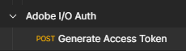
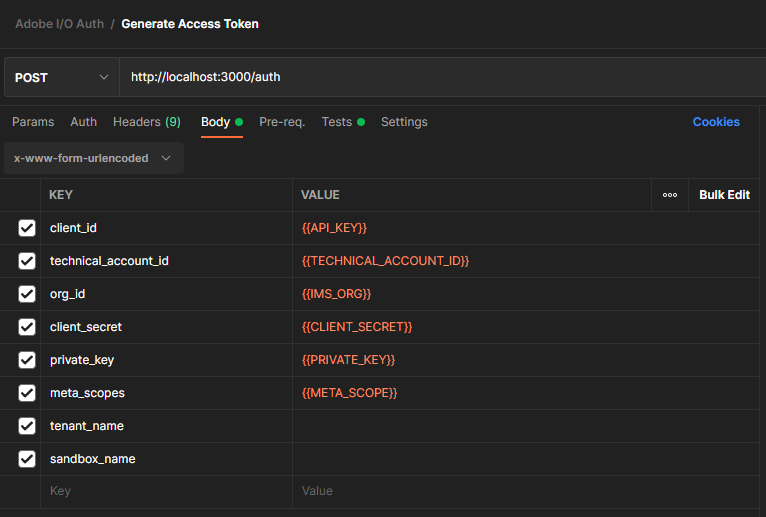

# adobe-io-developer-app
 
This is a quick start Node.js app for anyone looking to start playing with the Adobe Experience Platform APIs or Adobe I/O webhooks. It has two methods is supports today:

* GET '/' - receives and responds to challenge request when setting up a webhook in Adobe I/O
* POST '/auth' - used to locally sign a JWT and request an access token from Adobe IMS

## Dependencies
* node.js - https://nodejs.org/en/download/
* Express - https://expressjs.com/en/starter/installing.html
* @adobe/jwt-auth - https://github.com/adobe/jwt-auth
* ngrok - https://ngrok.com/download (or other webhook software)


## Installation Instructions
This instruction list applies for users installing via Ubuntu in WSL

1. Download git repo to your desktop and store in a directory  
```
Example:  /mnt/c/users/eknee/apps/adobe_auth/
```

2. Install node.js  
```
sudo apt-get update
sudo apt-get install nodejs
```

3. Install npm (nodes package manager)  
```
sudo apt-get install npm
```

4. Navigate to the directory you downloaded the initial repo and install express
```
cd /mnt/c/users/eknee/apps/adobe_auth/
npm install express --save
```

5. In the same directory also install @adobe/jwt-auth  
```
npm install @adobe/jwt-auth
```

### Start your local auth server
To start the server simple navigate to the directory where you did the installation and execute the following command:
```node auth.js```
You should then see this response in the CLI interface  
```Started server at http://localhost:3000```


### Setup Postman
Import the postman collection from the directory you downloaded the repo into [Adobe I/O Auth Collection](postman/Adobe%20I-O%20Auth.postman_collection.json).  You should see the following in postman  


The request is pre-configured to use use the existing postman environment variables you can download with your integration in Adobe I/O  


A successful response should return the payload shown below which is automatically parsed and appended to your environments ACCESS_TOKEN variable.  You can then reference that in all subsequent calls.
```
{
    "token_type": "bearer",
    "access_token": "XXXXXXXX",
    "expires_in": 86399988,
    "psql": "psql 'sslmode=require host=somehostname.platform-query.adobe.io port=80 dbname=prod:all user=someorg@AdobeOrg password=XXXXX'"
}
```